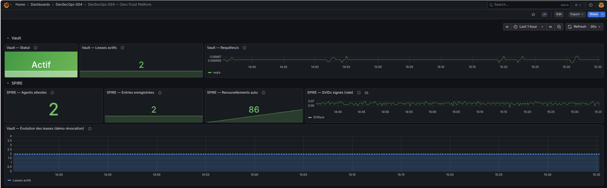
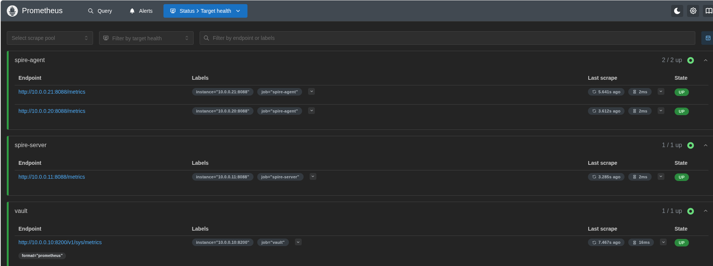

# Observabilité - Prometheus + Grafana

## Architecture

Prometheus et Grafana tournent en Docker Compose **sur le laptop**, avec `network_mode: host` pour accéder directement aux VMs via le réseau virbr1 (10.0.0.0/24).

```
laptop (10.0.0.1)
├── prometheus :9090   ← scrape les 4 endpoints
└── grafana    :3000   ← dashboard zero-trust

VMs
├── vault-server  10.0.0.10:8200  /v1/sys/metrics  (unauthenticated_metrics_access)
├── spire-server  10.0.0.11:8088  /metrics          (ufw 10.0.0.0/24)
├── workload-a    10.0.0.20:8088  /metrics          (ufw 10.0.0.0/24)
└── workload-b    10.0.0.21:8088  /metrics          (ufw 10.0.0.0/24)
```

## Démarrage

```bash
make obs-up      # lance Prometheus + Grafana
make obs-down    # arrête
make obs-status  # état des conteneurs
```

- Prometheus : http://localhost:9090
- Grafana    : http://localhost:3000 (admin / admin)

## Dashboard - DevSecOps Zero-Trust Platform

### Dashboard Grafana



### Targets Prometheus



---

### Section Vault

| Panel | Métrique | Lecture |
|---|---|---|
| **Vault - Statut** | `vault_core_active` | `Actif` (vert) = unsealed et leader HA. `Sealed` (rouge) = Vault a redémarré, il faut `make vault-unseal`. |
| **Vault - Leases actifs** | `vault_expire_num_leases` | Credentials dynamiques vivants (DB, SSH OTP). Monte quand on génère des secrets, descend après révocation ou expiration. |
| **Vault - Requêtes/s** | `rate(vault_barrier_get_count[1m])` | Activité globale de Vault (opérations storage). Spike visible lors de toute opération de démo. |

**Auth Prometheus** : accès non-authentifié aux métriques via `unauthenticated_metrics_access = true` dans le bloc `listener` de `vault.hcl`. Aucun token nécessaire.

---

### Section SPIRE

| Panel | Métrique | Lecture |
|---|---|---|
| **SPIRE - Agents attestés** | `spire_server_rpc_agent_v1_agent_attest_agent{status="OK"}` | Nombre d'agents ayant présenté un join token valide. Doit être **2** (workload-a + workload-b). |
| **SPIRE - Entries enregistrées** | `spire_server_datastore_registration_entry_create{status="OK"}` | Registration entries créées depuis le démarrage du server. |
| **SPIRE - Renouvellements auto** | `spire_server_rpc_agent_v1_agent_renew_agent{status="OK"}` | Renouvellements d'identité d'agents **sans intervention humaine**. Monte toutes les ~4 min (SVID TTL = 5 min, renouvellement à 80%). C'est le principe *continuous verification* du zero-trust en action. |
| **SPIRE - SVIDs signés (rate)** | `rate(spire_server_server_ca_sign_x509_svid[5m])` | Taux de certificats X.509 émis par la CA interne SPIRE. Spike visible au démarrage des agents et à chaque cycle de renouvellement. |

**Telemetry SPIRE** : activée dans `server.conf` et `agent.conf` avec `host = "0.0.0.0"` pour écouter sur toutes les interfaces (par défaut SPIRE bind sur loopback uniquement).

---

### Graphe pleine largeur

| Panel | Usage démo |
|---|---|
| **Vault - Evolution des leases** | Lancer `make demo-db` pour générer un lease → la courbe monte. Révoquer avec `vault lease revoke <id>` → descend immédiatement. Illustre la gestion du cycle de vie des secrets. |

## Commandes utiles pendant la démo

```bash
# Générer de l'activité Vault (fait monter leases + requêtes)
make demo-db        # credentials DB dynamiques
make demo-otp       # OTP SSH
make demo-transit   # chiffrement as a service

# Voir les targets Prometheus
open http://localhost:9090/targets

# Forcer un spike SPIRE (redémarre un agent → reattestation visible)
ssh -i ~/.ssh/devsecops ubuntu@10.0.0.20 'sudo systemctl restart spire-agent'
```

## Tokens et accès

| Secret | Emplacement | Usage |
|---|---|---|
| Grafana admin | `admin` / `admin` | Interface locale uniquement |

## Fichiers

```
observability/
├── docker-compose.yml              # Prometheus + Grafana, network_mode: host
├── prometheus/
│   └── prometheus.yml              # 4 scrape jobs (vault, spire-server, spire-agent x2)
└── grafana/
    ├── provisioning/
    │   ├── datasources/prometheus.yml
    │   └── dashboards/dashboards.yml
    └── dashboards/
        └── zero-trust.json         # 8 panels, 2 sections Vault / SPIRE
```
